# BigQuery NYC Taxi Demand--EDA and Prediction

+ This project was conducted by Young Sim.

+ **Keywords: Exploratory Data Analysis, Feature Engineering, Data Visualization, Machine Learning, Prediction Modeling, Linear Regression, Random Forest, XGBoost, LightGBM, BigQuery, SQL, Python**

+ **Objectives**: The goal of this project is finding trends, identifying problems, and making predictions on taxi demand to ultimately maximize revenue.

+ **Summary**:
  Below is the summary and key takeaways from the project. See project notebooks for more details.
  + NYC taxi data is loaded from BigQuery public data using SQL and BigQuery API Client library.
  + EDA: Through explorary data analysis, I analyzed taxi demand by different times and regions and created interactive visualizations, summarizing their main characteristics and trends. Some key visualizations and findings are as follows:
    
    
    
    Overview of taxi demand: dip on January 27th due to January 2015 North American blizzard.
     
    
    
    Trips by hour:
    + Peak: 18 ~ 19
    + Off-peak: 5 
    
    
    
    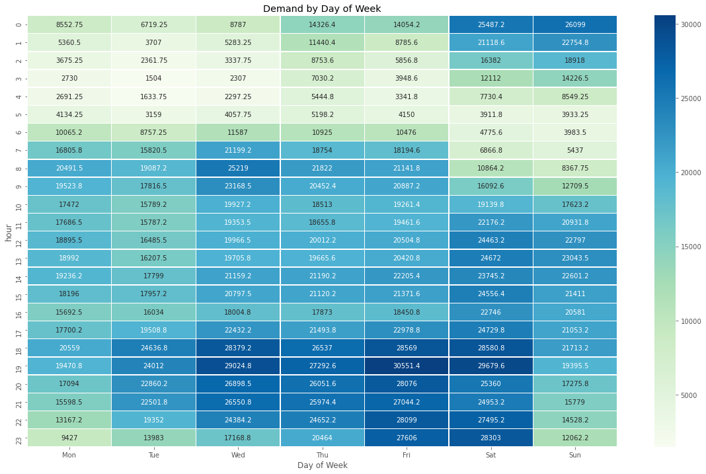
    
    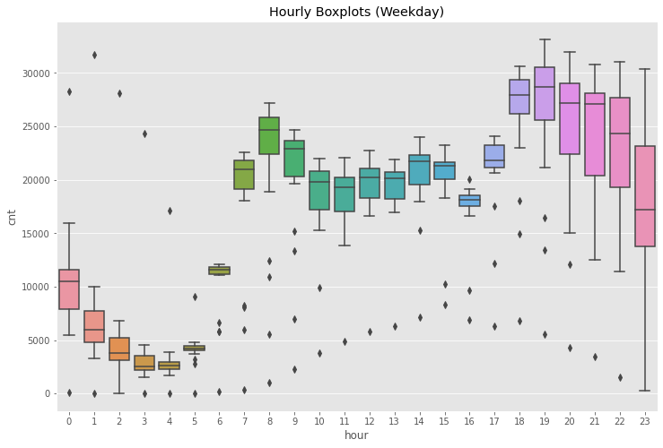  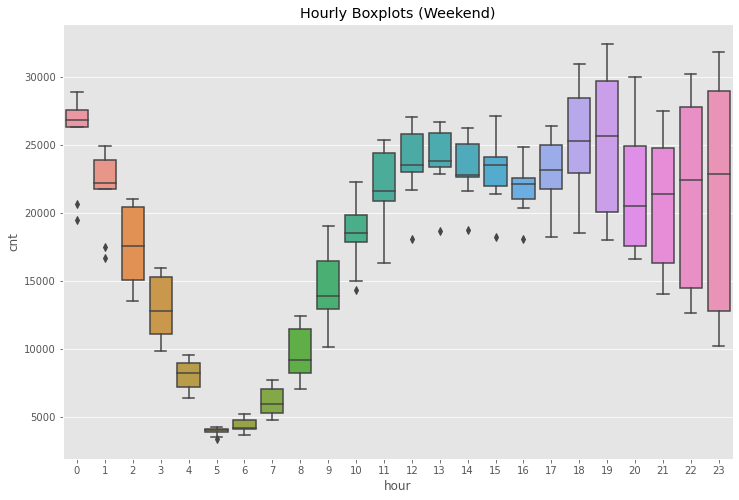
    
    On weekdays, more calls are in the morning and evening. On weekends, calls ten to increase in late hours.
     
    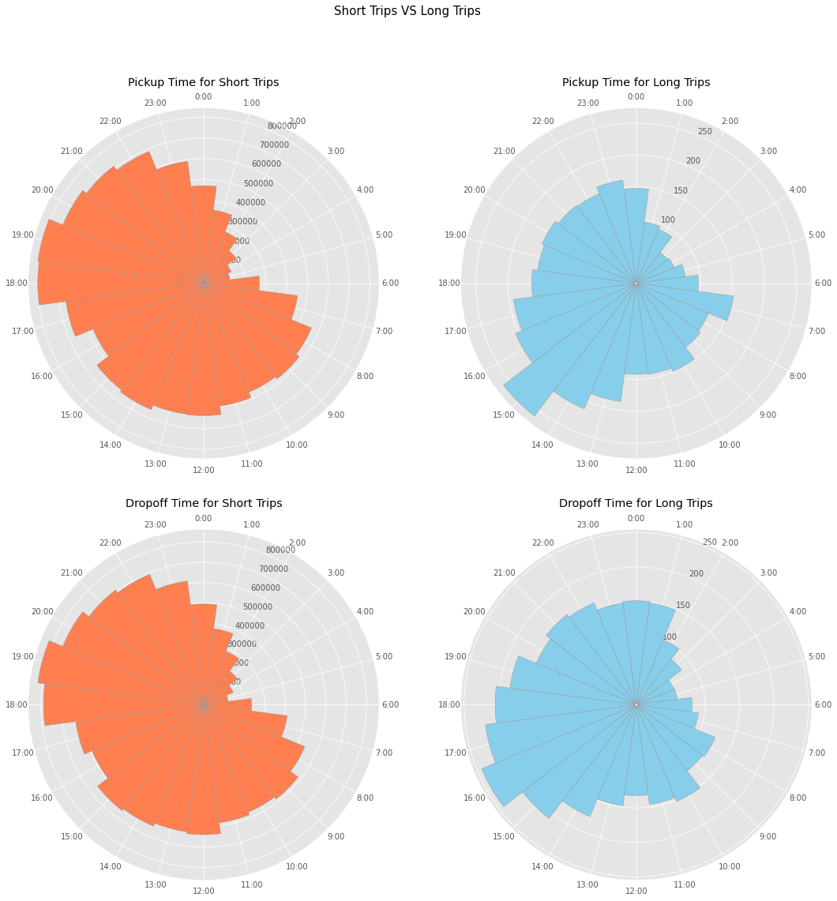
    
    The majority of the trips have distances under 30. So I divided trips into two groups--short trips (<30) and long trips (>=30). Peak times in the two groups are as follows:
    + Short trips: 18:00 ~ 20:00
    + Long trips: 15:00 ~ 17:00
    
    
    
    Visualized number of calls by zipcode after reverse geocoding (longitude/latitude to address) using Interactive Map in Kepler.gl.
    
    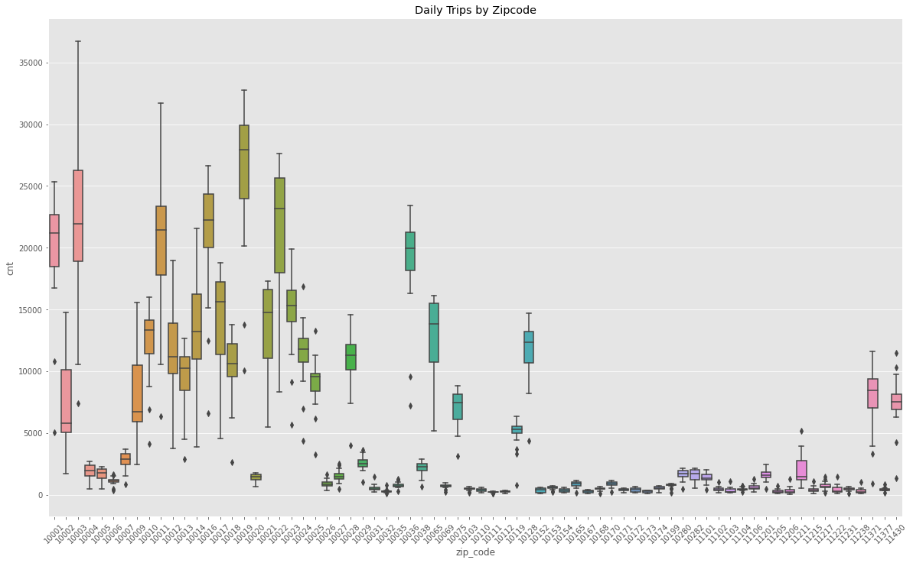
    
    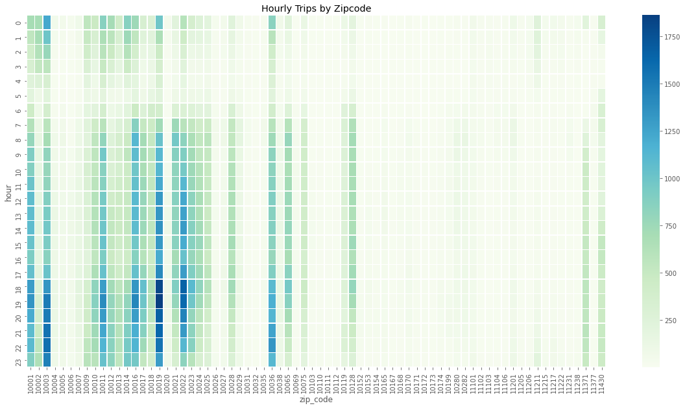
    
    From the above visualizations, we can observe that there is a big difference in demand in different parts of the city.
    
  + Insights from EDA: taxi demand vary by different times and regions. If we can predict taxi demand given different times and regions, we can possibly maximize revenue by placing more cars where demand is high.
  
  + Prediction: four prediction models have been trained.
    + Baseline simple linear model: chosen as baseline model for easy interpretability
    
    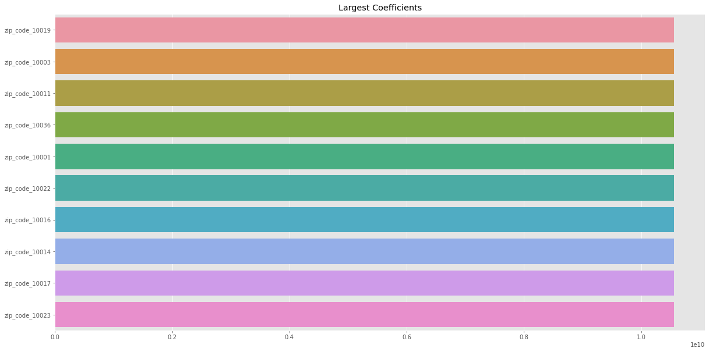  
    
    Dummy variables for zipcodes had the largest coefficient values.
    
    Additional models are as follows:
    + Random forest regressor
    + XGBoost regressor
    + LightGBM regressor
    
    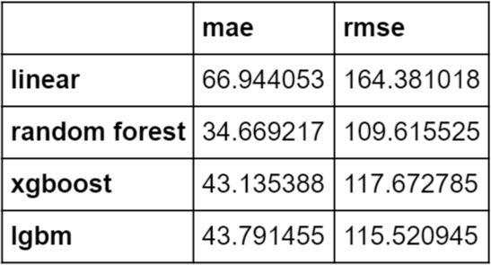
    
    Random Forest model showed the best results. The feature importance is as follows.
    
    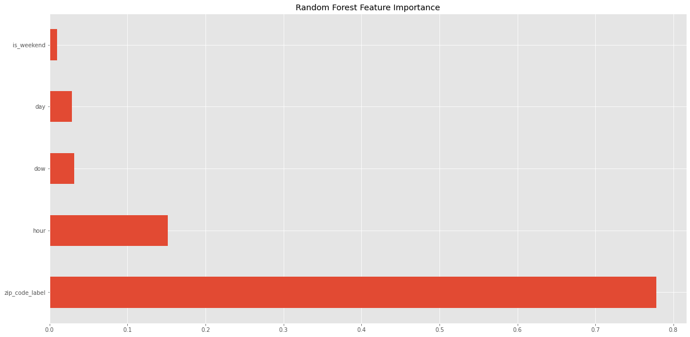
    
    The below graphs show the true values and predictions from Random Forest displayed by different times, showing where the model performed better predicting and where it did not. Note that it performs better for more important features.
    
    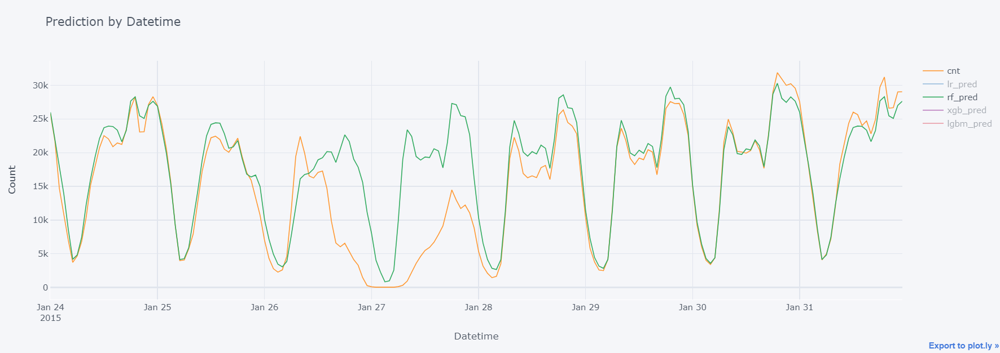
    
    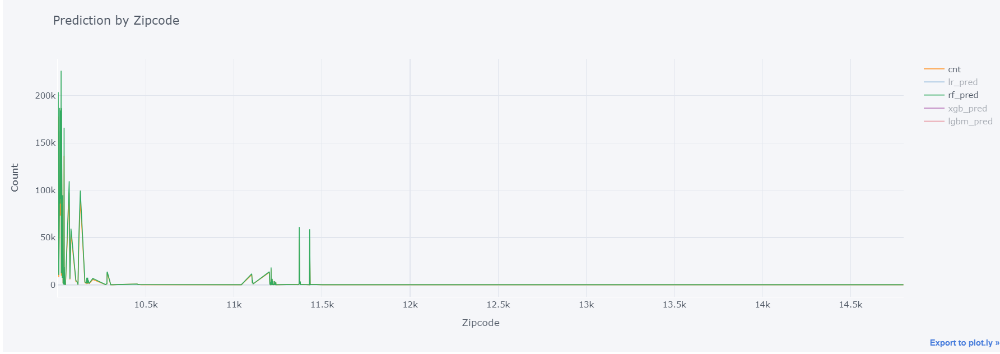
    
    
    
    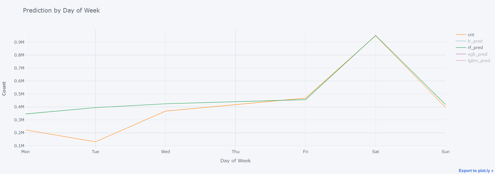
    
    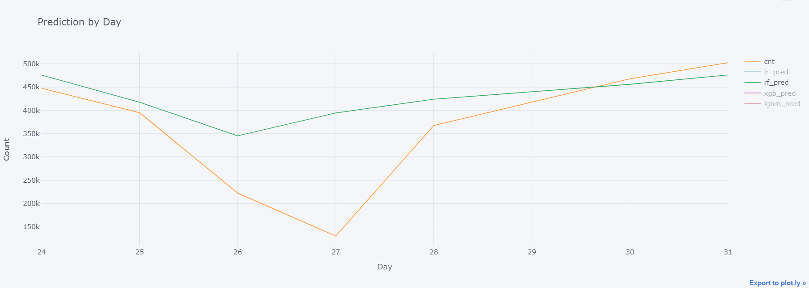
    
    
    
    Based on feature importance and the above visualizations, we can conclude that the location ,represented by zipcode, is the most important feature in predicting taxi demand. Overall, this project will be a good baseline for further model development for taxi demand prediction, with the ultimate goal of maximizing revenue.
    
  + Suggestions for further improvement:
    + Feature Engineeering:
      + Add lagged variables (e.g. demand in the zipcode area one hour ago, one day ago, etc.)
      + Mean encoding
      + Would zipcode be the best way to represent location? Try other ways (e.g. geohash, h3 ...)
      + Try half hour instead of hour feature
    + Add more features:
      + Holidays
      + Weather
    + Improvements in models:
      + Try other models
      + More parameter tuning
      + Automate updates for new data and retraining
      
+ **Contributions**:
  + Cleaned, transformed, and loaded data using SQL and BigQuery API Client library to conduct project with BigQuery public data in Python.
  + Performed exploratory data analysis of taxi calls based on time and region in order to find trends and identify problems to solve.
  + Produced feature engineering for categorical feature, tuned parameters, and trained models such as baseline simple linear regression, Random Forest, XGBoost, and LightGBM to predict taxi call demands in different times and regions.
  + Evaluated models by MAE and RMSE as well as analyzed results by visualizing interactive plots to show prediction values in comparison to true values in different times and regions.

Following [suggestions](http://nicercode.github.io/blog/2013-04-05-projects/) by [RICH FITZJOHN](http://nicercode.github.io/about/#Team) (@richfitz). This folder is orgarnized as follows.

```
proj/
├── doc/ project notebooks.
└── figs/ figures.
```

Please see each subfolder for a README file.

